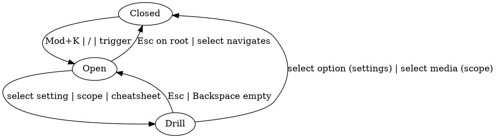

# Command Menu — Extensible Feature

**Date:** 2026-05-08
**Status:** Draft
**Owner:** apps/client
**Related:** [frontend-feature-architecture](./2026-04-29-frontend-structure-design.md), [home-page-backend](./2026-05-05-home-page-backend-design.md)

## 1. Goal

Promote command menu → fully functional feature module. Extensible registry. Backend-wired search. TanStack Hotkeys for all keyboard. Inline quick-settings (theme, locale) via drill-in.

## 2. Why

Current state: `app/command-menu/` static. Search hits in-memory pool. Hotkeys via window keydown. Theme = single cycle action, no real settings UI. Hard to add new contributions (action / page / setting) without editing menu internals.

Goal state:
- One feature module owns menu + registry.
- Each contribution = own file. Add file → menu picks up. Tree-shakeable.
- Search = real backend → live results.
- Hotkeys = TanStack lib → cross-platform Mod, sequences, cheatsheet from registrations.
- Settings drill-in pattern → reusable for any enum-shaped setting.

## 3. Scope

**In:**
- Move `app/command-menu/` → `features/command-menu/`.
- Contribution registry (page / action / search-mode / setting).
- Drill-stack nav (replace single-scope state).
- `/api/search` endpoint + client `useSearchResults`.
- TanStack Hotkeys: ⌘K, /, Esc, sequences (g h, g l, g s), per-row hotkeys, cheatsheet.
- Theme + locale as `SettingItem` contributions.

**Out (YAGNI):**
- Server-side recents (stays localStorage).
- Voice / NL search.
- Plugin-pkg contributions (registry closed to client pkgs v1).
- Density toggle, notifications-pref drill.

## 4. Module layout

```
apps/client/src/features/command-menu/
├── api.ts                         # Hono client wrapper for search
├── query-keys.ts                  # searchKeys factory
├── errors.ts                      # CommandMenuError
├── types.ts                       # contribution types, NavFrame, ActionContext
├── registry/
│   ├── index.ts                   # re-exports + COMMAND_CONTRIBUTIONS aggregate
│   ├── pages.ts                   # COMMAND_PAGES: PageItem[]
│   ├── actions.ts                 # COMMAND_ACTIONS: ActionItem[]
│   ├── search-modes.ts            # COMMAND_SEARCH_MODES: SearchModeItem[]
│   └── settings/
│       ├── index.ts               # COMMAND_SETTINGS = [theme, locale]
│       ├── theme.ts               # SettingItem<ThemeName>
│       └── locale.ts              # SettingItem<Locale>
├── hooks/
│   ├── use-command-menu.ts        # open + nav-stack state
│   ├── use-command-hotkeys.ts     # all TanStack Hotkeys wiring
│   ├── use-search-results.ts      # React Query for /api/search
│   └── use-recent-items.ts        # localStorage recents (existing)
├── components/
│   ├── command-menu.tsx           # root surface
│   ├── command-search-header.tsx  # input + breadcrumb + scope chip
│   ├── command-row.tsx            # generic row (icon, label, hint, kbd, badge)
│   ├── media-row.tsx              # row variant for MediaItem
│   ├── setting-drill.tsx          # generic drill content for SettingItem<T>
│   ├── shortcuts-cheatsheet.tsx   # registrations → grouped list
│   └── command-footer.tsx         # kbd hints + brand
├── lib/
│   ├── match-values.ts            # mediaMatchValue, contributionMatchValue
│   ├── nav-stack.ts               # frames reducer
│   └── i18n.ts                    # static t() helper (existing)
└── index.ts                       # public: <CommandMenu />, <CommandMenuMediaProvider />
```

`apps/client/src/app/command-menu.tsx` → 5-line mount of `features/command-menu`. `app/command-menu-trigger.tsx` (top-nav button) unchanged.

`shared/components/command-menu-media-provider.tsx` → folds into feature module (re-exported from `index.ts`).

## 5. Contribution types

```ts
// types.ts
import type { LucideIcon } from "lucide-react";
import type { StaticMessageKey } from "@/paraglide/messages";

export type ContributionKind = "page" | "action" | "search-mode" | "setting";

type Base = {
  id: string;                          // unique across all contributions
  Icon: LucideIcon;
  labelKey: StaticMessageKey;
  hintKey: StaticMessageKey;
  /** Hide row when false. Lets features gate via flag/role.
   *  Evaluated on every render of the menu surface — caller must keep
   *  thunk cheap or memoize feature-flag reads upstream. */
  enabled?: () => boolean;
  /** Order inside group; lower first. Default 100. */
  order?: number;
  /** Optional global hotkey (e.g. "Mod+Shift+T"). Registers via useHotkeys. */
  hotkey?: string;
};

export type PageItem = Base & {
  kind: "page";
  to: PageRoute;
  /** Optional vim-sequence (e.g. ["g","h"]). Registers via useHotkeySequences. */
  sequence?: readonly string[];
};

export type ActionItem = Base & {
  kind: "action";
  run: (ctx: ActionContext) => void;
};

export type SearchModeItem = Base & {
  kind: "search-mode";
  scope: "tv" | "movie";
};

export type SettingOption<T extends string> = {
  id: T;
  Icon?: LucideIcon;
  labelKey: StaticMessageKey;
  hintKey?: StaticMessageKey;
};

export type SettingItem<T extends string = string> = Base & {
  kind: "setting";
  options: readonly SettingOption<T>[];
  read: () => T;
  write: (next: T) => void;
  /** Toast on successful write. Receives the new option. */
  toastKey?: StaticMessageKey;
};

export type ActionContext = {
  push: (frame: NavFrame) => void;
  close: () => void;
};

export type NavFrame =
  | { kind: "root" }
  | { kind: "scope"; scope: "tv" | "movie" }
  | { kind: "setting"; settingId: string }
  | { kind: "cheatsheet" };
```

Rules:
- Each contribution file exports one constant (`THEME_SETTING`, `HOME_PAGE`, …).
- `registry/<kind>/index.ts` aggregates: `export const COMMAND_SETTINGS = [THEME_SETTING, LOCALE_SETTING] as const;`.
- `registry/index.ts` exports kind-keyed map for menu consumer.
- Adding contribution → 2 file edits: new file + 1 line in kind index. No menu-internal change.

## 6. Drill-stack nav

State = `{ frames: NavFrame[] }`. Stack always has `{ kind: "root" }` at index 0.

```ts
// lib/nav-stack.ts
type NavAction =
  | { type: "push"; frame: NavFrame }
  | { type: "pop" }
  | { type: "reset" };

const initial: NavState = { frames: [{ kind: "root" }] };

function reducer(state: NavState, action: NavAction): NavState {
  switch (action.type) {
    case "push":
      return { frames: [...state.frames, action.frame] };
    case "pop":
      return state.frames.length > 1
        ? { frames: state.frames.slice(0, -1) }
        : state;
    case "reset":
      return initial;
  }
}
```

Behavior:
- Esc on non-root frame → pop. Esc on root → close.
- Backspace on empty input + non-root → pop.
- Close (any reason) → reset stack.
- Top frame drives content + breadcrumb in header.

## 7. Backend search

### 7.1 Endpoint

`GET /api/search?q=<string>&kind=tv|movie|all&limit=<int>`

Auth: same `/api/*` middleware as home endpoints (better-auth session). Anonymous → 401.

`compactMediaItemSchema` already lives in `@nama/shared/home`; reused here, not duplicated.

```ts
// packages/shared/src/search/schemas.ts
export const searchQuerySchema = z.object({
  q: z.string().min(1).max(80),
  kind: z.enum(["tv", "movie", "all"]).default("all"),
  limit: z.coerce.number().int().min(1).max(50).default(20),
});

export const searchResponseSchema = z.object({
  results: z.array(compactMediaItemSchema),
  hasMore: z.boolean(),
});
```

Subpath export `@nama/shared/search` added to `packages/shared/package.json`.

### 7.2 Server impl

`apps/server/src/api/procedures/search.ts`:
- Validates query via zod.
- Dispatches `metadata@v1.search` via `MediaService` (`apps/server/src/media/service.ts`) — primary plugin (typically TMDB) is the source of truth, not the catalog cache.
- Maps each plugin hit to `CompactMediaItem[]`. Asks for `limit + 1` so `hasMore = post-filter > limit` without a second call.
- 400 on bad input. 500 on upstream error (caught by the shared `errorHandler` middleware which captures via diagnostics service).

### 7.3 Client wiring

```ts
// hooks/use-search-results.ts
export function useSearchResults(rawQuery: string, scope: CommandScope) {
  const deferred = useDeferredValue(rawQuery);
  const debounced = useDebouncedValue(deferred, 200);
  const enabled = debounced.trim().length >= 2;

  return useQuery({
    queryKey: searchKeys.list(debounced, scope ?? "all"),
    queryFn: () => api.search({ q: debounced, kind: scope ?? "all", limit: 20 }),
    enabled,
    staleTime: 30_000,
    placeholderData: (prev) => prev,           // smooth typing
  });
}
```

Section render rules:
- `q.length < 2` → recents + trending (existing pool source).
- `q.length >= 2 && pending` → trending stays + skeleton row.
- `success` → results group replaces trending; recents still shown if any match `id`.
- `error` → inline retry row inside results group.

## 8. TanStack Hotkeys

Pkg: `@tanstack/react-hotkeys`. Add to `apps/client` deps.

New Paraglide keys to add (full list — caller adds to `project.inlang/messages/`):

- `hotkey_toggle_menu_name`, `hotkey_toggle_menu_desc`
- `hotkey_open_menu_name`, `hotkey_open_menu_desc`
- `command_menu_setting_theme_label`, `command_menu_setting_theme_hint`
- `command_menu_setting_locale_label`, `command_menu_setting_locale_hint`
- `theme_system_label`, `theme_light_label`, `theme_dark_label`
- `locale_<code>_label` per supported locale

### 8.1 Global hotkeys (`use-command-hotkeys.ts`)

```ts
useHotkey("Mod+K", () => toggleOpen(), {
  meta: { name: t("hotkey_toggle_menu_name"), description: t("hotkey_toggle_menu_desc") },
});

useHotkey("/", () => openIfClosed(), {
  ignoreInputs: true,
  meta: { name: t("hotkey_open_menu_name"), description: t("hotkey_open_menu_desc") },
});

useHotkey("Escape", () => closeOrPop(), {
  enabled: open,
  preventDefault: false,
  stopPropagation: false,
});
```

`Mod` = Meta on macOS / Ctrl elsewhere → drops manual `metaKey || ctrlKey` check.

### 8.2 Page sequences

```ts
useHotkeySequences(
  pages
    .filter((p) => p.sequence)
    .map((p) => ({
      sequence: p.sequence!,
      callback: () => navigate({ to: p.to }),
      options: {
        meta: { name: t(p.labelKey), description: t(p.hintKey) },
      },
    })),
  // Disabled while menu open so typing in input doesn't trigger.
  { enabled: !open },
);
```

Default sequences: `g h` → /, `g l` → /library, `g w` → /watchlist, `g s` → /settings, `g c` → /settings/connections.

### 8.3 Per-row hotkeys

```ts
useHotkeys(
  contributions
    .filter((c) => c.hotkey)
    .map((c) => ({
      hotkey: c.hotkey!,
      callback: () => runContribution(c),
      options: { meta: { name: t(c.labelKey), description: t(c.hintKey) } },
    })),
  { conflictBehavior: "warn" },
);
```

Row renders `<Kbd>` next to label when `hotkey` set.

### 8.4 Cheatsheet

`shortcuts-cheatsheet.tsx`:

```tsx
const { hotkeys, sequences } = useHotkeyRegistrations();
// Group by source:
//   "Menu"      — Mod+K, /, Esc
//   "Navigate"  — sequences (g h, g l, ...)
//   "Actions"   — per-row contributions
// Each row: <Kbd>...</Kbd> + meta.name + meta.description.
```

Reached via action `act:show-shortcuts` → `push({ kind: "cheatsheet" })`.

## 9. Inline settings — drill pattern

`setting-drill.tsx` is generic over `SettingItem<T>`:

```tsx
function SettingDrill<T extends string>({ setting, onPop }: Props<T>) {
  const current = setting.read();
  return (
    <CommandList>
      <CommandGroup heading={t(setting.labelKey)}>
        {setting.options.map((opt) => (
          <CommandItem
            key={opt.id}
            value={settingMatchValue(setting, opt)}
            onSelect={() => {
              setting.write(opt.id);
              if (setting.toastKey) toast.success(m[setting.toastKey]());
              onPop();
            }}
          >
            <RowIcon Icon={opt.Icon ?? setting.Icon} />
            <RowContent label={t(opt.labelKey)} hint={opt.hintKey ? t(opt.hintKey) : ""} />
            {opt.id === current && <CheckIcon className="size-4 text-primary" />}
          </CommandItem>
        ))}
      </CommandGroup>
    </CommandList>
  );
}
```

### 9.1 Theme contribution

> **Amendment (2026-05-15):** `id` is `setting:theme` (the registry standard prefix, not the
> `set:` short form drafted here); `hotkey` is `Mod+Alt+T` (rebound to avoid the browser's
> Mod+Shift+T "reopen closed tab" conflict — see `.changeset/theme-hotkey-rebind.md`);
> `toastKey` was dropped because the bound theme writer flips the document class
> synchronously, so a follow-up toast carries no extra information.

```ts
// registry/settings/theme.ts
export const THEME_SETTING: SettingItem<"system" | "light" | "dark"> = {
  kind: "setting",
  id: "setting:theme",
  Icon: Sparkles,
  labelKey: "command_menu_setting_theme_label",
  hintKey: "command_menu_setting_theme_hint",
  hotkey: "Mod+Alt+T",
  options: [
    { id: "system", labelKey: "theme_system_label", Icon: Monitor },
    { id: "light",  labelKey: "theme_light_label",  Icon: Sun },
    { id: "dark",   labelKey: "theme_dark_label",   Icon: Moon },
  ],
  // Bound at runtime via useTheme() — see §9.3.
  read: () => "system",
  write: () => {},
};
```

### 9.2 Locale contribution

```ts
// registry/settings/locale.ts
export const LOCALE_SETTING: SettingItem<Locale> = {
  kind: "setting",
  id: "set:locale",
  Icon: Globe,
  labelKey: "command_menu_setting_locale_label",
  hintKey: "command_menu_setting_locale_hint",
  options: SUPPORTED_LOCALES.map((loc) => ({
    id: loc,
    labelKey: `locale_${loc}_label` as StaticMessageKey,
  })),
  read: () => getLocale(),
  write: (next) => {
    setLocale(next, { reload: true });   // see §9.4
  },
};
```

### 9.3 Runtime binding

`read`/`write` need React hook context (theme, locale). Two options:

- **Bind at registry use-site (chosen).** Menu calls `bindSetting(THEME_SETTING, { read: () => theme, write: setTheme })` inside React. Registry holds defaults; runtime overrides.
- Reject: passing hooks into module-scope (breaks rules of hooks).

```ts
// hooks/use-bound-settings.ts
export function useBoundSettings(): readonly SettingItem[] {
  const { theme, resolvedTheme, setTheme } = useTheme();
  // `getLocale()` is non-reactive — the menu re-renders on drill pop, so
  // the fresh locale flows in without a reload.
  const currentLocale = getLocale();
  return useMemo(
    () => [
      { ...THEME_SETTING, read: () => (theme ?? resolvedTheme ?? "system") as ThemeName, write: setTheme },
      {
        ...LOCALE_SETTING,
        read: () => currentLocale,
        write: (l) => {
          setLocale(l, { reload: false });
          applyLocaleStyling();
        },
      },
    ],
    [theme, resolvedTheme, setTheme, currentLocale],
  );
}
```

### 9.4 Locale switch — resolved (hot-swap, no reload)

Paraglide picks locale at boot. The drill writes the new locale via `setLocale(next, { reload: false })` and immediately re-runs `applyLocaleStyling()` to refresh the `<html dir|lang>` attributes plus locale-specific font injection. Paraglide's `m.*` message helpers re-evaluate on each render, so any tree that re-renders after the write picks up the new translations — there is no `needsReload` helper, no `window.location.reload()`, and no session drop.

## 10. Render flow



Top frame → which content renders:

| Frame | Groups shown |
|---|---|
| `root`, `q === ""` | search-modes, recents, pages, actions, settings (all `enabled`) |
| `root`, `q !== ""` | matched pages/actions/settings + search-results group |
| `scope(tv\|movie)`, `q === ""` | trending (kind-filtered) |
| `scope(tv\|movie)`, `q !== ""` | search-results (kind-filtered) |
| `setting(id)` | drill rows for `setting.options` |
| `cheatsheet` | grouped registrations |

## 11. Errors & edge cases

| Case | Behavior |
|---|---|
| Search net err | Inline retry row. Recents/trending unaffected. |
| `q.length < 2` | No fetch. No spinner. Show recents/trending. |
| `setting.write` throws | `toast.error`. Stack stays. Drill stays. |
| Hotkey conflict | `conflictBehavior: "warn"` (dev console). App globals use `"replace"` to win. |
| RTL query (Persian/Arabic) | `dir="auto"` on input. Already handled; preserve. |
| Menu opens during sequence | Sequences disabled when `open` (commonOptions). |
| Esc inside drill input | Pops frame, doesn't close. |
| Recents updated in another tab | `storage` event listener in `useRecentItems` picks up the change; same-tab writes do not echo (browser `storage` event fires only in other tabs). |

## 12. Testing

### Unit (vitest + RTL)

| File | Covers |
|---|---|
| `lib/nav-stack.test.ts` | push/pop/reset; pop floor at root |
| `registry/settings/theme.test.ts` | options shape, hotkey set, toastKey |
| `registry/index.test.ts` | id uniqueness across all contributions |
| `hooks/use-search-results.test.ts` | gate at <2 chars, debounce, error → retry, scope filter |
| `components/command-menu.test.tsx` | drill: select Theme → 3 rows → check on current → select Light → write called → pop |
| `components/setting-drill.test.tsx` | generic drill render, current marker, write+toast |
| `components/shortcuts-cheatsheet.test.tsx` | groups registrations by meta source |
| `hooks/use-command-hotkeys.test.tsx` | Mod+K toggle, "/" open, Esc close/pop, sequence disabled when open |

### Integration (server)

| File | Covers |
|---|---|
| `apps/server/src/api/procedures/__tests__/search.test.ts` | 200 OK shape, 400 on bad kind, 400 on q too long, scope filter, limit cap |

## 13. Migration plan

Pre-stable → breaking OK. One step per PR. Each PR own changeset.

| # | Step | Touches |
|---|---|---|
| 1 | Add `/api/search` + `@nama/shared/search` schemas | server, shared |
| 2 | Move `app/command-menu/*` → `features/command-menu/*`. Update imports. No behavior change. | client |
| 3 | Add `types.ts` + nav-stack reducer. Refactor menu to consume stack (single-scope kept as scope frame). | client |
| 4 | Swap custom keydown for TanStack Hotkeys. Add sequences. Cheatsheet sub-page. | client |
| 5 | Build `setting-drill.tsx`. Convert theme action → `THEME_SETTING`. | client |
| 6 | Add `LOCALE_SETTING`. Verify locale hot-swap (else reload). | client |
| 7 | Wire `useSearchResults`. Drop pool-as-search-source. Pool stays for recents/trending (still sourced from `CommandMenuMediaProvider` populated by home feature data — unchanged). | client |

## 14. Invariants

- Each contribution `id` unique across all kinds.
- `registry/index.ts` exports stable order; menu never sorts mutably. Sort key: `(order ?? 100, id)` — `id` as deterministic tiebreaker.
- Drill stack root frame always present.
- Settings `read()`/`write()` pure relative to the bound runtime; no side effects beyond storage + theme/locale system.
- Search query never sent if `q.trim().length < 2`.
- Hotkey `meta.name` set on every `useHotkey`/`useHotkeys` call → cheatsheet stays complete.
- Backend `/api/search` returns `CompactMediaItem` shape only → menu has no kind-specific render branches.

## 15. Non-goals (explicit)

- Server-side recents.
- Voice / NL input.
- Density toggle, notification-pref drill.
- Plugin-pkg contributions.
- Search relevance tuning beyond catalog-service default.

> **Note (2026-06-16):** Cross-tab recents sync was previously listed here as a non-goal.
> It was implemented in the #608 fix PR via a `storage` event listener in `useRecentItems`
> (client-only, zero backend cost). It is now in scope and documented in §11.
